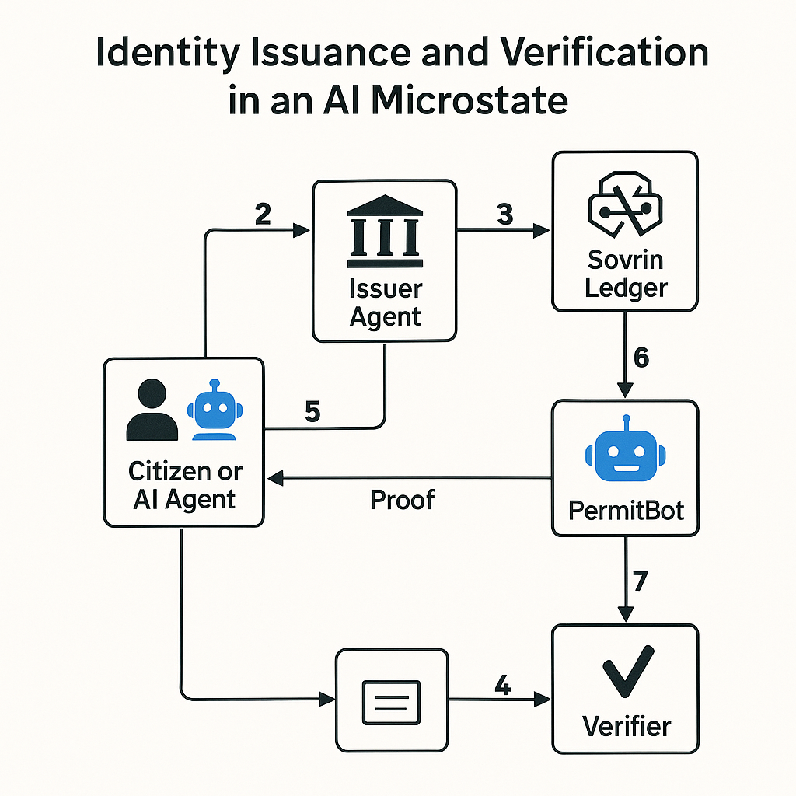

# [ÅILAND](https://ai-cosmos-breathe-flow.lovable.app)
A study of how to possibly create the first AI micro state originating from Åland.

## Question
If one were to build a state from the ground up with todays AI support, how would it look like?

## Background Research
OpenAI Deep Research (1+1 h research) [CHAT RAW](https://chatgpt.com/s/dr_68150fe331e88191b3a60213bb110089 )

DOWNLOAD .WAV IN REPO OR LISTEN HERE TO SWEDISH PODCAST (AI GENERATED) ON THE REPORT 
[PODCAST](https://youtu.be/LmIoK-tPHKI)

## Architecture
Core problem is identity and trust or reputation-system.

### Decentralized Identity Architecture 


### 🧠 Core Functions for an AI-Driven Microstate

| **Domain**               | **Function Needed**                            | **Automation Potential** | **AI Technologies Needed**                                    |
|--------------------------|------------------------------------------------|---------------------------|----------------------------------------------------------------|
| **Identity & Access**    | Digital ID & Authentication                    | High                      | Identity verification, blockchain/DLT, biometric recognition   |
| **Administration**       | Citizen self-service portal                    | High                      | NLP chatbots, expert systems, RPA                              |
|                          | Records & registry management                  | High                      | RPA, document AI, rule-based automation                        |
|                          | Permit/license processing                      | High                      | Expert systems, OCR/NLP, automated workflows                   |
|                          | Inter-agency data exchange                     | High                      | Secure data interoperability platform (e.g. X-Road)            |
| **Finance & Tax**        | Tax calculation & filing                       | High                      | Rule-based engines, anomaly detection, predictive analytics    |
|                          | Budget forecasting & allocation                | Medium–High               | ML models, economic simulators                                 |
|                          | Expense tracking & procurement                 | Medium–High               | Optimization algorithms, spend analytics                       |
| **Healthcare**           | Appointment scheduling & triage                | High                      | Chatbots, decision trees, speech-to-text                       |
|                          | Diagnostic decision support                    | Medium                    | Medical imaging AI, symptom checker NLP                        |
|                          | Public health monitoring                       | High                      | ML prediction, anomaly detection in health trends              |
| **Education**            | Personalized learning platforms                | Medium                    | AI tutors, recommendation engines                              |
|                          | Student performance tracking                   | High                      | Learning analytics, dashboarding                               |
| **Social Services**      | Benefit eligibility decisions                  | High                      | Expert systems, RPA                                            |
|                          | Risk prediction for at-risk groups             | Medium–High               | Predictive ML, classification models                           |
| **Law Enforcement**      | Predictive policing (patrol optimization)      | Medium                    | Pattern recognition, geographic heat mapping                   |
|                          | Surveillance & anomaly detection               | Medium–High               | Computer vision, facial recognition                            |
|                          | Environmental & zoning compliance              | High                      | Satellite imagery analysis, drone vision, geospatial AI        |
| **Judicial**             | Small claims resolution                        | Medium                    | Rule-based AI judges, NLP, case triage                         |
|                          | Dispute mediation support                      | Medium                    | NLP dialogue systems, sentiment analysis                       |
|                          | Legal research & decision drafting             | High                      | NLP, semantic search, summarization                           |
| **Legislation**          | Policy impact simulation                       | Low–Medium                | Multi-variable modeling, agent-based simulations               |
|                          | Public sentiment analysis                      | Medium                    | NLP, social listening tools                                    |
| **Diplomacy/External**   | Data-driven negotiation prep                   | Low                       | Translation AI, economic modeling                              |
|                          | AI-supported treaty analysis                   | Low                       | NLP legal summarization                                        |
| **Governance Oversight**| Audit trail generation & transparency tools    | High                      | Explainable AI (XAI), blockchain logs                          |
|                          | Ethical compliance monitoring                  | Medium                    | AI bias detection, fairness analysis                           |
|                          | Human-in-the-loop escalation systems           | Required                  | Workflow routing, override mechanisms                          |


## [Taskmaster](https://github.com/eyaltoledano/claude-task-master)
Taskmaster generated PRD and tasks:
```json
{
  "tasks": [
    {
      "id": 1,
      "title": "Set up Foundational Infrastructure",
      "description": "Establish the base infrastructure layer including compute, storage, networking, and security components",
      "status": "pending",
      "dependencies": [],
      "priority": "high",
      "details": "Deploy cloud infrastructure with redundancy across multiple regions. Set up Kubernetes clusters for containerized services. Implement network security with VPCs, firewalls, and WAFs. Configure monitoring and alerting systems. Establish CI/CD pipelines for automated deployment. Create disaster recovery procedures and backup systems. Consider using AWS, Azure, or GCP with Terraform for infrastructure as code.",
      "testStrategy": "Perform load testing, security penetration testing, and disaster recovery simulations. Validate monitoring systems by triggering test alerts. Verify backup and restore functionality.",
      "subtasks": [
        {
          "id": 1,
          "title": "Define Infrastructure as Code (IaC) Repository and Standards",
          "description": "Set up a version-controlled repository for infrastructure code and establish coding standards, naming conventions, and documentation requirements",
          "status": "pending",
          "dependencies": [],
          "details": "Create a Git repository for Terraform code. Define folder structure separating environments (dev/staging/prod). Establish naming conventions for resources. Create README with architecture diagrams. Set up branch protection rules. Include linting configurations for Terraform. Choose cloud provider (AWS/Azure/GCP) based on requirements and document decision rationale."
        },
        {
          "id": 2,
          "title": "Deploy Core Networking Infrastructure",
          "description": "Establish the foundational network architecture across multiple regions with proper segmentation and security",
          "status": "pending",
          "dependencies": [
            1
          ],
          "details": "Use Terraform to create VPCs/VNets in at least two regions. Implement subnets for different tiers (public, private, data). Configure inter-region connectivity with transit gateways or peering. Set up route tables and network ACLs. Implement VPN connections for secure administrative access. Deploy network security groups and firewall rules following least privilege principle. Configure DNS services and private endpoints for cloud services."
        },
        {
          "id": 3,
          "title": "Implement Identity and Access Management",
          "description": "Set up comprehensive IAM framework with role-based access control and secure authentication mechanisms",
          "status": "pending",
          "dependencies": [
            1
          ],
          "details": "Configure cloud IAM services with multi-factor authentication. Create service accounts with minimal permissions for automation. Implement role-based access control (RBAC) for different teams. Set up identity federation with corporate directory if applicable. Create key rotation policies. Implement secrets management solution (HashiCorp Vault, AWS Secrets Manager, etc.). Document access patterns and emergency procedures."
        },
        {
          "id": 4,
          "title": "Deploy Kubernetes Clusters and Container Registry",
          "description": "Set up production-grade Kubernetes clusters across regions with associated container registries",
          "status": "pending",
          "dependencies": [
            2,
            3
          ],
          "details": "Deploy managed Kubernetes services (EKS/AKS/GKE) in multiple regions using Terraform. Configure node pools with appropriate instance types and auto-scaling. Implement private container registry with vulnerability scanning. Set up network policies for pod-to-pod communication. Configure cluster RBAC tied to IAM. Implement pod security policies. Set up persistent storage classes. Configure cluster autoscaler and horizontal pod autoscaler."
        },
        {
          "id": 5,
          "title": "Implement Monitoring, Logging, and Alerting",
          "description": "Deploy comprehensive observability stack for infrastructure and application monitoring",
          "status": "pending",
          "dependencies": [
            4
          ],
          "details": "Deploy Prometheus and Grafana (or cloud-native alternatives) for metrics collection and visualization. Implement centralized logging with Elasticsearch (or cloud alternatives). Set up distributed tracing with Jaeger or similar. Configure alerting with PagerDuty or OpsGenie integration. Create dashboards for key metrics. Implement log retention policies. Set up automated health checks. Configure cost monitoring and anomaly detection."
        },
        {
          "id": 6,
          "title": "Establish CI/CD Pipelines",
          "description": "Create automated pipelines for infrastructure and application deployment",
          "status": "pending",
          "dependencies": [
            4,
            5
          ],
          "details": "Set up GitLab CI, GitHub Actions, or Jenkins for pipeline automation. Create pipeline templates for infrastructure deployment with Terraform. Implement application deployment pipelines with canary or blue-green capabilities. Configure automated testing in pipelines (infrastructure validation, security scanning). Implement approval gates for production deployments. Set up artifact management. Create documentation for pipeline usage and troubleshooting."
        },
        {
          "id": 7,
          "title": "Implement Backup and Disaster Recovery",
          "description": "Create comprehensive backup strategy and disaster recovery procedures",
          "status": "pending",
          "dependencies": [
            2,
            4,
            5
          ],
          "details": "Implement automated backup solutions for databases and stateful services. Configure cross-region replication for critical data. Create disaster recovery runbooks with clear procedures. Implement infrastructure recovery automation with Terraform. Set up regular DR testing schedule. Configure backup retention policies compliant with requirements. Implement monitoring for backup success/failure. Document RTO (Recovery Time Objective) and RPO (Recovery Point Objective) for different services."
        }
      ]
    },
    {
      "id": 2,
      "title": "Implement Digital Identity System",
      "description": "Build the decentralized identity infrastructure for citizen and agent authentication",
      "status": "pending",
      "dependencies": [
        1
      ],
      "priority": "high",
      "details": "Integrate with Sovrin Ledger for decentralized identity. Implement verifiable credentials system with issuance, verification, and revocation capabilities. Create biometric authentication mechanisms. Develop trust framework and governance policies. Build identity lifecycle management (registration, updates, revocation). Implement privacy-preserving features using zero-knowledge proofs where appropriate.",
      "testStrategy": "Test identity issuance and verification flows with mock citizens. Validate security through penetration testing. Verify compliance with privacy regulations. Test revocation and recovery processes.",
      "subtasks": [
        {
          "id": 1,
          "title": "Set up Sovrin Ledger Integration",
          "description": "Establish connection and integration with the Sovrin network for decentralized identity management",
          "status": "pending",
          "dependencies": [],
          "details": "Implement SDK integration with Sovrin network. Create connection pools to access the ledger. Set up node agent configuration for writing and reading from the distributed ledger. Develop transaction handlers for DID operations. Implement error handling and retry mechanisms for network operations. Create a configuration module for environment-specific settings (dev, staging, production)."
        },
        {
          "id": 2,
          "title": "Develop Verifiable Credentials System",
          "description": "Build the core infrastructure for issuing, verifying, and revoking verifiable credentials",
          "status": "pending",
          "dependencies": [
            1
          ],
          "details": "Implement W3C Verifiable Credentials data model. Create credential issuance service with digital signing capabilities. Develop verification service to validate credential authenticity and provenance. Build revocation registry and status checking mechanism. Implement credential schema management. Create credential templates for different identity attributes. Develop secure storage for credential data with encryption."
        },
        {
          "id": 3,
          "title": "Implement Biometric Authentication",
          "description": "Create secure biometric authentication mechanisms for identity verification",
          "status": "pending",
          "dependencies": [
            1
          ],
          "details": "Integrate with biometric capture devices/APIs (fingerprint, facial recognition). Implement secure biometric template storage with encryption. Develop biometric matching algorithms or integrate with existing solutions. Create biometric verification workflows. Implement liveness detection to prevent spoofing. Build fallback authentication methods. Ensure compliance with biometric data protection regulations."
        },
        {
          "id": 4,
          "title": "Build Identity Lifecycle Management",
          "description": "Develop the complete identity lifecycle from registration through updates to revocation",
          "status": "pending",
          "dependencies": [
            1,
            2
          ],
          "details": "Create identity registration process with verification steps. Implement identity attribute management system. Develop identity update mechanisms with proper versioning. Build identity recovery processes for lost credentials. Implement identity revocation workflows. Create audit logging for all lifecycle events. Develop administrative interfaces for identity management operations."
        },
        {
          "id": 5,
          "title": "Implement Privacy-Preserving Features",
          "description": "Develop zero-knowledge proof capabilities and other privacy-enhancing technologies",
          "status": "pending",
          "dependencies": [
            2,
            4
          ],
          "details": "Implement zero-knowledge proof libraries for selective disclosure. Create attribute-based disclosure mechanisms. Develop unlinkable credential presentations to prevent correlation. Implement data minimization techniques. Build consent management for attribute sharing. Create privacy-preserving authentication flows. Develop pseudonymous identity capabilities for different contexts."
        },
        {
          "id": 6,
          "title": "Establish Trust Framework and Governance",
          "description": "Define and implement the governance policies and trust framework for the identity system",
          "status": "pending",
          "dependencies": [
            2,
            4,
            5
          ],
          "details": "Develop trust anchor management for credential issuers. Implement policy enforcement points throughout the system. Create governance dashboards for system oversight. Develop compliance reporting mechanisms. Implement trust registry for authorized issuers and verifiers. Build policy management interfaces. Create documentation for governance processes. Implement automated policy checks for credential operations."
        }
      ]
    },
    {
      "id": 3,
      "title": "Develop Unified Citizen/Agent Portal",
      "description": "Create the main interface for all citizen and agent interactions with the microstate",
      "status": "pending",
      "dependencies": [
        2
      ],
      "priority": "high",
      "details": "Build responsive web application with mobile support. Implement authentication using the identity system. Create dashboard for service discovery and status tracking. Develop notification system for updates and alerts. Implement accessibility features (WCAG compliance). Design with multilingual support. Use React/Vue for frontend with a Node.js or Python backend. Implement analytics to track usage patterns.",
      "testStrategy": "Conduct usability testing with diverse user groups. Perform cross-browser and cross-device testing. Validate accessibility compliance. Test performance under various network conditions.",
      "subtasks": [
        {
          "id": 1,
          "title": "Set up project architecture and authentication integration",
          "description": "Establish the foundational architecture for the portal and integrate with the identity system for authentication",
          "status": "pending",
          "dependencies": [],
          "details": "Create a new React project with responsive design using a UI framework like Material-UI or Tailwind CSS. Set up the project structure following best practices with separate components, services, and state management. Implement routing with protected routes. Integrate with the identity system for user authentication, including login, registration, password reset, and session management. Ensure the authentication flow works for both citizens and agents with appropriate role-based access control."
        },
        {
          "id": 2,
          "title": "Develop service discovery dashboard and status tracking",
          "description": "Create the main dashboard interface for discovering available services and tracking their status",
          "status": "pending",
          "dependencies": [
            1
          ],
          "details": "Design and implement the main dashboard that displays available services categorized by type (e.g., administrative, financial, legal). Create service cards with descriptions, requirements, and current status. Implement a status tracking system that shows the progress of user-initiated service requests with clear status indicators. Add filtering and search functionality to help users find services quickly. Ensure the dashboard adapts to different user roles (citizen vs. agent) showing relevant information and actions for each."
        },
        {
          "id": 3,
          "title": "Implement notification system and alerts",
          "description": "Build a comprehensive notification system to keep users informed about updates and important alerts",
          "status": "pending",
          "dependencies": [
            1,
            2
          ],
          "details": "Develop a notification service that can handle different types of notifications (system alerts, status updates, reminders). Implement real-time notifications using WebSockets or a similar technology. Create a notification center UI component that displays recent notifications with read/unread status. Add support for notification preferences allowing users to choose delivery methods (in-app, email, SMS). Implement push notifications for the mobile version of the application."
        },
        {
          "id": 4,
          "title": "Add accessibility features and multilingual support",
          "description": "Ensure the portal is accessible to all users and supports multiple languages",
          "status": "pending",
          "dependencies": [
            1,
            2,
            3
          ],
          "details": "Audit and implement WCAG 2.1 AA compliance across all components. Add proper semantic HTML, ARIA attributes, keyboard navigation, and screen reader support. Implement high contrast mode and text resizing options. Set up internationalization (i18n) infrastructure using a library like react-i18next or react-intl. Create translation files for at least 3 primary languages. Implement language selection UI and ensure all text, including dynamic content and notifications, is properly translated. Test with screen readers and accessibility tools to verify compliance."
        },
        {
          "id": 5,
          "title": "Implement analytics and finalize mobile responsiveness",
          "description": "Add analytics tracking and ensure full mobile compatibility across all features",
          "status": "pending",
          "dependencies": [
            1,
            2,
            3,
            4
          ],
          "details": "Integrate an analytics solution (like Google Analytics, Matomo, or a custom solution) to track user interactions, service usage patterns, and performance metrics. Create custom events for important user actions. Implement dashboards for administrators to view usage statistics. Thoroughly test and optimize the portal for mobile devices, ensuring all features work properly on small screens. Implement mobile-specific UI improvements like bottom navigation, touch-friendly controls, and optimized layouts. Conduct final cross-browser and cross-device testing to ensure consistent functionality."
        }
      ]
    },
    {
      "id": 4,
      "title": "Build Core Service Orchestration Layer",
      "description": "Implement the event bus, policy rules engine, and lifecycle manager for service coordination",
      "status": "pending",
      "dependencies": [
        1
      ],
      "priority": "high",
      "details": "Develop event bus using Kafka or RabbitMQ for inter-service communication. Implement policy rules engine with BRMS (Business Rules Management System) like Drools. Create lifecycle manager for stateful processes using workflow engine (Camunda/Zeebe). Design service discovery mechanism. Implement circuit breakers and resilience patterns. Create monitoring and logging for all orchestration components.",
      "testStrategy": "Test event propagation under various load conditions. Validate policy rule execution with test cases. Verify lifecycle management with complex process scenarios. Test failure modes and recovery.",
      "subtasks": [
        {
          "id": 1,
          "title": "Implement Event Bus with Kafka",
          "description": "Set up and configure the event bus using Kafka for asynchronous inter-service communication",
          "status": "pending",
          "dependencies": [],
          "details": "Install and configure Kafka cluster with appropriate topic design. Implement producer/consumer patterns with proper serialization formats (Avro/Protobuf). Create reusable client libraries for services to publish/subscribe to events. Configure appropriate partitioning strategy, retention policies, and ensure at-least-once delivery semantics. Include comprehensive error handling and dead-letter queues for failed messages."
        },
        {
          "id": 2,
          "title": "Develop Service Discovery Mechanism",
          "description": "Implement service registry and discovery to enable dynamic service location and load balancing",
          "status": "pending",
          "dependencies": [
            1
          ],
          "details": "Implement service registry using Consul or etcd. Create service registration process for application startup. Develop health check mechanisms to detect service availability. Implement client-side service discovery with caching and fallback strategies. Configure DNS integration if needed. Ensure the discovery mechanism works with containerized deployments and cloud environments."
        },
        {
          "id": 3,
          "title": "Implement Policy Rules Engine",
          "description": "Create a business rules management system using Drools for centralized policy enforcement",
          "status": "pending",
          "dependencies": [
            1
          ],
          "details": "Set up Drools rule engine with appropriate rule repository. Design domain-specific language for business rules. Implement rule authoring, versioning, and deployment pipeline. Create integration points with the event bus to trigger rule evaluation. Develop caching strategy for rule execution. Build testing framework for rule validation. Implement monitoring for rule execution performance and outcomes."
        },
        {
          "id": 4,
          "title": "Build Lifecycle Manager with Workflow Engine",
          "description": "Implement stateful process management using Camunda for long-running business processes",
          "status": "pending",
          "dependencies": [
            1,
            3
          ],
          "details": "Install and configure Camunda BPM engine. Design and implement BPMN workflows for key business processes. Create service task implementations to integrate with other services. Implement compensation and error handling for failed processes. Develop persistence layer for workflow state. Create APIs for workflow initiation, monitoring, and management. Implement event listeners to trigger workflow steps based on system events."
        },
        {
          "id": 5,
          "title": "Implement Circuit Breakers and Resilience Patterns",
          "description": "Add fault tolerance mechanisms to prevent cascading failures across services",
          "status": "pending",
          "dependencies": [
            2
          ],
          "details": "Implement circuit breaker pattern using Resilience4j or Hystrix. Configure timeout, retry, and fallback strategies for service calls. Implement bulkhead pattern to isolate failures. Create rate limiters to prevent overload. Develop back-pressure mechanisms for handling traffic spikes. Implement graceful degradation strategies when dependencies are unavailable. Create configuration system for tuning resilience parameters."
        },
        {
          "id": 6,
          "title": "Develop Monitoring and Logging Infrastructure",
          "description": "Implement comprehensive observability for all orchestration components",
          "status": "pending",
          "dependencies": [
            1,
            2,
            3,
            4,
            5
          ],
          "details": "Implement distributed tracing using OpenTelemetry or Jaeger. Create structured logging with correlation IDs across services. Set up metrics collection for all orchestration components (Prometheus). Develop dashboards for system health visualization (Grafana). Implement alerting for critical failures. Create performance benchmarks and SLO monitoring. Develop audit logging for compliance and debugging. Implement log aggregation and search capabilities."
        }
      ]
    },
    {
      "id": 5,
      "title": "Implement Data & AI Core",
      "description": "Create the interoperability layer, bias monitoring, and appeals gateway",
      "status": "pending",
      "dependencies": [
        4
      ],
      "priority": "high",
      "details": "Develop data interoperability layer using X-Road principles. Implement data lake/warehouse for analytics. Create bias and fairness monitoring system with regular audits. Build appeals gateway for contesting automated decisions. Implement explainable AI wrapper for all decision systems. Set up feature store for ML model training. Develop model versioning and governance system.",
      "testStrategy": "Test data exchange between different systems. Validate bias detection with test datasets. Verify appeals process with simulated contested decisions. Test explainability of AI decisions with diverse stakeholders.",
      "subtasks": [
        {
          "id": 1,
          "title": "Develop Data Interoperability Layer",
          "description": "Create a secure data exchange layer based on X-Road principles to enable standardized data sharing between different systems",
          "status": "pending",
          "dependencies": [],
          "details": "Implement REST and SOAP API adapters with standardized data formats (JSON, XML). Create secure authentication using JWT/OAuth2. Develop data transformation services for format conversion. Implement logging and monitoring for all data exchanges. Use message queuing (RabbitMQ/Kafka) for asynchronous communication. Document all APIs using OpenAPI/Swagger."
        },
        {
          "id": 2,
          "title": "Build Data Lake and Warehouse Architecture",
          "description": "Establish a scalable data storage and processing infrastructure for analytics and ML workloads",
          "status": "pending",
          "dependencies": [
            1
          ],
          "details": "Implement data lake using object storage (S3/Azure Blob) for raw data. Create data warehouse using columnar storage (Snowflake/Redshift) for structured data. Develop ETL pipelines using Apache Spark/Airflow for data transformation. Implement data quality checks and validation rules. Set up data cataloging and metadata management. Configure appropriate access controls and encryption."
        },
        {
          "id": 3,
          "title": "Implement Feature Store for ML",
          "description": "Create a centralized repository for storing, managing, and serving ML features",
          "status": "pending",
          "dependencies": [
            2
          ],
          "details": "Implement offline store using SQL database for batch features. Create online store using Redis/DynamoDB for low-latency feature serving. Develop feature registration and discovery API. Implement feature versioning and lineage tracking. Create feature computation pipelines with caching. Add monitoring for feature drift and quality. Provide SDK for feature access from training and inference code."
        },
        {
          "id": 4,
          "title": "Develop Model Versioning and Governance System",
          "description": "Create infrastructure for tracking, versioning, and governing ML models throughout their lifecycle",
          "status": "pending",
          "dependencies": [
            3
          ],
          "details": "Implement model registry using MLflow/Neptune. Create CI/CD pipelines for model training and deployment. Develop model metadata schema including version, performance metrics, and training data. Implement approval workflows for model promotion. Create model lineage tracking. Set up model artifact storage with versioning. Implement model deployment and rollback mechanisms."
        },
        {
          "id": 5,
          "title": "Create Explainable AI Wrapper",
          "description": "Develop a system that provides explanations for all AI-based decisions",
          "status": "pending",
          "dependencies": [
            4
          ],
          "details": "Implement SHAP/LIME integration for feature importance. Create counterfactual explanation generator. Develop natural language explanation templates. Implement visualization components for explanation UI. Create API for requesting explanations for specific decisions. Add logging of all explanations for audit purposes. Develop documentation on explanation limitations and interpretation."
        },
        {
          "id": 6,
          "title": "Implement Bias and Fairness Monitoring System",
          "description": "Build a comprehensive system to detect, measure, and report bias in AI models",
          "status": "pending",
          "dependencies": [
            5
          ],
          "details": "Implement fairness metrics calculation (demographic parity, equal opportunity). Create protected attribute identification and handling. Develop bias detection algorithms for both training and inference. Implement regular automated bias audits with reporting. Create dashboards for bias visualization. Set up alerts for bias threshold violations. Develop documentation on bias mitigation strategies."
        },
        {
          "id": 7,
          "title": "Build Appeals Gateway for Automated Decisions",
          "description": "Create a system allowing users to contest and appeal automated decisions",
          "status": "pending",
          "dependencies": [
            5,
            6
          ],
          "details": "Implement appeals submission API and UI. Create case management system for tracking appeals. Develop integration with explainability system to provide decision context. Implement workflow for human review of appealed decisions. Create notification system for appeal status updates. Develop reporting and analytics on appeal patterns. Implement feedback loop to improve models based on successful appeals."
        }
      ]
    },
    {
      "id": 6,
      "title": "Develop Administration & Finance Services",
      "description": "Implement initial sector services for administration and financial operations",
      "status": "pending",
      "dependencies": [
        3,
        4,
        5
      ],
      "priority": "medium",
      "details": "Build records and registry management system. Implement permit/license processing with OCR and NLP. Create tax calculation and filing system with rule engines. Develop budget forecasting using ML models. Implement expense tracking and procurement optimization. Create anomaly detection for financial transactions. Integrate with the unified portal for citizen access.",
      "testStrategy": "Test permit processing with various document types. Validate tax calculations against known examples. Test budget forecasting against historical data. Verify anomaly detection with simulated fraud scenarios.",
      "subtasks": [
        {
          "id": 1,
          "title": "Implement Records and Registry Management System",
          "description": "Build the core records and registry management system that will serve as the foundation for administration services",
          "status": "pending",
          "dependencies": [],
          "details": "Develop a database schema for storing various administrative records and documents. Implement CRUD operations for managing records. Create indexing and search functionality for efficient retrieval. Build access control mechanisms based on user roles. Implement document versioning and audit trails. Ensure the system can handle various document types and formats. Create APIs for integration with other services."
        },
        {
          "id": 2,
          "title": "Develop Permit and License Processing System with OCR/NLP",
          "description": "Create a system for processing permits and licenses using OCR and NLP technologies",
          "status": "pending",
          "dependencies": [
            1
          ],
          "details": "Implement OCR functionality to extract information from scanned permit/license applications. Develop NLP components to interpret and categorize extracted text. Create workflows for permit approval processes with configurable steps. Build validation rules for different permit types. Implement notification system for status updates. Create dashboards for administrators to monitor processing status. Integrate with the records management system for document storage."
        },
        {
          "id": 3,
          "title": "Build Tax Calculation and Filing System",
          "description": "Implement a comprehensive tax calculation and filing system with configurable rule engines",
          "status": "pending",
          "dependencies": [
            1
          ],
          "details": "Develop a rule engine for tax calculations that can be configured for different tax types. Implement tax filing workflows with validation and verification steps. Create forms for different tax types with appropriate validation. Build reporting functionality for tax authorities. Implement payment processing integration. Create audit trails for all tax-related transactions. Develop user dashboards for tracking filing status and payment history."
        },
        {
          "id": 4,
          "title": "Create Budget Forecasting System with ML Models",
          "description": "Develop a budget forecasting system using machine learning models to predict financial trends",
          "status": "pending",
          "dependencies": [
            3
          ],
          "details": "Implement data collection pipelines for historical financial data. Develop feature engineering for financial data preprocessing. Create ML models for revenue and expenditure forecasting. Build visualization components for forecast results. Implement scenario analysis functionality for what-if planning. Create model performance monitoring and retraining pipelines. Develop APIs for integration with other financial systems."
        },
        {
          "id": 5,
          "title": "Implement Expense Tracking and Procurement Optimization",
          "description": "Build a system for tracking expenses and optimizing procurement processes",
          "status": "pending",
          "dependencies": [
            3,
            4
          ],
          "details": "Develop expense categorization and tracking functionality. Implement approval workflows for expenses with configurable rules. Create procurement request and approval processes. Build vendor management system with performance metrics. Implement budget checking against forecasts. Develop reporting and analytics for expense patterns. Create optimization algorithms for procurement decisions based on historical data."
        },
        {
          "id": 6,
          "title": "Develop Financial Anomaly Detection and Portal Integration",
          "description": "Implement anomaly detection for financial transactions and integrate all services with the unified citizen portal",
          "status": "pending",
          "dependencies": [
            2,
            3,
            5
          ],
          "details": "Develop anomaly detection algorithms for identifying unusual financial patterns. Create alert mechanisms for potential fraud or errors. Implement investigation workflows for flagged transactions. Build dashboards for monitoring system health. Develop API endpoints for unified portal integration. Create user interfaces for citizen access to all implemented services. Implement single sign-on and consistent user experience across all financial and administrative services."
        }
      ]
    },
    {
      "id": 7,
      "title": "Implement Healthcare & Education Services",
      "description": "Build sector-specific services for healthcare and education",
      "status": "pending",
      "dependencies": [
        5,
        6
      ],
      "priority": "medium",
      "details": "Develop appointment scheduling and triage system with chatbots. Implement diagnostic decision support with medical AI integration. Create public health monitoring with anomaly detection. Build personalized learning platform with AI tutors. Implement student performance tracking with learning analytics. Create secure health data exchange compliant with privacy regulations.",
      "testStrategy": "Test appointment scheduling with various scenarios. Validate triage accuracy with test cases. Test learning platform with diverse student profiles. Verify health data privacy compliance.",
      "subtasks": [
        {
          "id": 1,
          "title": "Design and implement appointment scheduling system with chatbot interface",
          "description": "Create the core appointment scheduling system for healthcare services with an integrated chatbot for patient interaction",
          "status": "pending",
          "dependencies": [],
          "details": "Develop a RESTful API for appointment management (CRUD operations). Implement a rule-based chatbot using a framework like Rasa or Dialogflow that can understand appointment requests, check availability, and handle basic triage questions. Design database schema for storing appointment data, provider availability, and patient information. Ensure the system includes notification capabilities (email/SMS). Create a simple frontend interface for appointment management."
        },
        {
          "id": 2,
          "title": "Implement secure health data exchange platform with privacy compliance",
          "description": "Build a secure data exchange system that adheres to healthcare privacy regulations (HIPAA, GDPR) for sharing patient information",
          "status": "pending",
          "dependencies": [
            1
          ],
          "details": "Implement end-to-end encryption for all patient data. Create role-based access control system with detailed audit logging. Design and implement secure API endpoints for data exchange between healthcare providers. Develop data anonymization and pseudonymization capabilities for research use cases. Implement consent management system for patient data sharing. Create comprehensive documentation on compliance measures. Include automated compliance checking tools to verify system meets regulatory requirements."
        },
        {
          "id": 3,
          "title": "Develop diagnostic decision support system with medical AI integration",
          "description": "Create a system that assists healthcare providers with diagnostic decisions by integrating with medical AI models",
          "status": "pending",
          "dependencies": [
            2
          ],
          "details": "Implement API integrations with established medical AI providers (e.g., IBM Watson Health, Google Health). Create a middleware layer that standardizes inputs/outputs between different AI services. Develop a user interface for healthcare providers to input patient symptoms and review AI-suggested diagnoses. Implement a feedback mechanism for providers to rate AI suggestions. Build a knowledge base that stores previous cases and outcomes to improve future recommendations. Ensure all AI suggestions include confidence scores and supporting evidence."
        },
        {
          "id": 4,
          "title": "Build public health monitoring system with anomaly detection",
          "description": "Implement a system to monitor and analyze public health data to identify potential outbreaks or health trends",
          "status": "pending",
          "dependencies": [
            2
          ],
          "details": "Develop data ingestion pipelines for various public health data sources (hospital admissions, symptom reporting, etc.). Implement time-series analysis algorithms to establish baseline health metrics. Create anomaly detection models using statistical methods and machine learning. Build alerting system for when anomalies are detected. Develop visualization dashboard for health officials to monitor trends. Implement geographic clustering to identify location-based outbreaks. Create reporting tools for generating public health bulletins."
        },
        {
          "id": 5,
          "title": "Create personalized learning platform with AI tutors",
          "description": "Develop an adaptive learning platform that uses AI to personalize educational content and provide tutoring assistance",
          "status": "pending",
          "dependencies": [],
          "details": "Implement a content management system for educational materials with metadata tagging. Create learner profiles that track progress, strengths, and areas for improvement. Develop recommendation algorithms to suggest appropriate learning content. Implement NLP-based AI tutors that can answer questions and provide explanations. Create interactive learning exercises with automated feedback. Build a system for content sequencing based on learning outcomes and prerequisites. Develop an authoring tool for educators to create and modify content."
        },
        {
          "id": 6,
          "title": "Implement student performance tracking with learning analytics",
          "description": "Build a comprehensive analytics system to track and visualize student performance and learning patterns",
          "status": "pending",
          "dependencies": [
            5
          ],
          "details": "Design data collection mechanisms to capture detailed learning interactions. Implement learning analytics algorithms to identify patterns in student performance. Create predictive models to identify at-risk students. Develop customizable dashboards for students, teachers, and administrators with appropriate views. Build reporting tools for generating individual and class-level progress reports. Implement intervention recommendation system based on performance patterns. Create data export capabilities for research and further analysis. Ensure privacy controls allow appropriate data sharing while protecting student information."
        }
      ]
    },
    {
      "id": 8,
      "title": "Develop Social Services & Law Enforcement",
      "description": "Implement sector services for social welfare and law enforcement",
      "status": "pending",
      "dependencies": [
        5,
        6
      ],
      "priority": "medium",
      "details": "Build benefit eligibility decision system with expert systems. Implement risk prediction for at-risk groups. Create predictive policing system with pattern recognition. Develop surveillance and anomaly detection with computer vision. Implement environmental compliance monitoring with satellite/drone imagery. Create judicial support systems for small claims and dispute mediation.",
      "testStrategy": "Test benefit eligibility with various citizen profiles. Validate risk prediction against historical data. Test law enforcement systems with simulated scenarios. Verify ethical compliance of predictive systems.",
      "subtasks": [
        {
          "id": 1,
          "title": "Implement Benefit Eligibility Decision System",
          "description": "Create an expert system to determine eligibility for social welfare benefits",
          "status": "pending",
          "dependencies": [],
          "details": "Develop a rule-based expert system that processes applicant data against eligibility criteria. Include: (1) Data input module for collecting applicant information, (2) Rules engine with configurable policy parameters, (3) Explanation component that provides reasoning for decisions, (4) Appeals handling mechanism. Ensure transparency in decision-making and implement fairness auditing to prevent bias. Use decision trees and rule-based programming with clear documentation of all decision pathways."
        },
        {
          "id": 2,
          "title": "Develop Risk Prediction System for At-Risk Groups",
          "description": "Create a system to identify individuals who may need additional social support",
          "status": "pending",
          "dependencies": [
            1
          ],
          "details": "Build a machine learning system that identifies patterns indicating vulnerability. Include: (1) Data integration from multiple social service sources with privacy protections, (2) Feature engineering focused on evidence-based risk factors, (3) Model training with balanced datasets to prevent bias, (4) Confidence scoring for predictions, (5) Human-in-the-loop review process for all high-risk cases. Use ensemble methods combining multiple models to improve accuracy while maintaining explainability. Implement strict data governance protocols and regular bias audits."
        },
        {
          "id": 3,
          "title": "Create Predictive Policing System",
          "description": "Develop pattern recognition system to optimize law enforcement resource allocation",
          "status": "pending",
          "dependencies": [],
          "details": "Implement a spatiotemporal analysis system that identifies patterns in historical incident data. Include: (1) Data cleaning and normalization pipeline for police reports, (2) Hotspot mapping with temporal variation, (3) Pattern detection algorithms for crime series, (4) Resource allocation recommendation engine. Focus on transparency by clearly documenting all algorithms and assumptions. Implement safeguards against reinforcement bias by incorporating randomized patrol recommendations and regular model retraining. Ensure human oversight of all system recommendations."
        },
        {
          "id": 4,
          "title": "Implement Surveillance and Anomaly Detection",
          "description": "Develop computer vision system for public safety monitoring",
          "status": "pending",
          "dependencies": [
            3
          ],
          "details": "Create a computer vision system that can detect unusual activities or safety concerns in public spaces. Include: (1) Video processing pipeline with privacy-preserving features (e.g., automatic blurring of faces), (2) Anomaly detection models trained on normal behavior patterns, (3) Alert system with confidence scores, (4) Audit logging of all detections and actions. Implement strict access controls and retention policies for all footage. Design the system to minimize false positives and require human verification before any action is taken. Include comprehensive documentation on system limitations and potential biases."
        },
        {
          "id": 5,
          "title": "Develop Environmental Compliance Monitoring",
          "description": "Create system to analyze satellite/drone imagery for environmental regulation compliance",
          "status": "pending",
          "dependencies": [],
          "details": "Build an image analysis system that can detect environmental violations using remote sensing data. Include: (1) Image acquisition and preprocessing pipeline for satellite and drone imagery, (2) Change detection algorithms to identify unauthorized land use changes, (3) Pollution detection models (e.g., water contamination, emissions), (4) Reporting system that generates evidence packages for enforcement. Implement regular validation of detection accuracy using ground-truth data. Design the system to prioritize cases based on environmental impact severity and provide confidence scores for all detections."
        },
        {
          "id": 6,
          "title": "Create Judicial Support Systems",
          "description": "Implement systems for small claims processing and dispute mediation",
          "status": "pending",
          "dependencies": [
            1,
            2
          ],
          "details": "Develop a platform to facilitate resolution of small claims and disputes. Include: (1) Case intake and classification system, (2) Document analysis for relevant facts and precedents, (3) Structured negotiation platform with fairness guarantees, (4) Decision support for mediators and judges with similar case recommendations. Ensure the system maintains procedural fairness and provides equal access regardless of technical proficiency. Implement comprehensive logging of all system recommendations and decisions. Design the interface to be accessible to users with varying levels of legal knowledge and technical skills."
        }
      ]
    },
    {
      "id": 9,
      "title": "Implement Governance & Strategy Tools",
      "description": "Build policy simulation, AI lifecycle board, and continuous improvement mechanisms",
      "status": "pending",
      "dependencies": [
        5,
        6,
        7,
        8
      ],
      "priority": "medium",
      "details": "Develop policy simulation tools using agent-based modeling. Create AI lifecycle board dashboard for oversight. Implement public sentiment analysis with NLP. Build continuous improvement framework with feedback loops. Create audit trail generation with blockchain. Implement ethical compliance monitoring. Develop human-in-the-loop escalation workflows.",
      "testStrategy": "Test policy simulations against historical outcomes. Validate sentiment analysis with diverse text samples. Test audit trail immutability. Verify escalation workflows with complex scenarios.",
      "subtasks": [
        {
          "id": 1,
          "title": "Develop AI Lifecycle Board Dashboard",
          "description": "Create a centralized dashboard for oversight of AI systems throughout their lifecycle",
          "status": "pending",
          "dependencies": [],
          "details": "Implement a web-based dashboard that tracks AI systems from development through deployment and maintenance. Include metrics for model performance, data quality, usage statistics, and risk assessments. Design the UI with role-based access controls for different stakeholders (developers, compliance officers, executives). Use a modern frontend framework (React/Vue) with a backend API that can aggregate data from various system components. This will serve as the foundation for other governance tools."
        },
        {
          "id": 2,
          "title": "Implement Audit Trail Generation with Blockchain",
          "description": "Create an immutable audit trail system using blockchain technology",
          "status": "pending",
          "dependencies": [
            1
          ],
          "details": "Develop a blockchain-based audit trail system that records all significant actions and decisions within the AI system. Use a permissioned blockchain framework (like Hyperledger Fabric) to store hashed records of model updates, data access, policy changes, and user interactions. Implement APIs to write events to the blockchain and to query the audit trail. Integrate with the AI Lifecycle Board to display audit information. Include functionality to export audit trails for external review or regulatory compliance."
        },
        {
          "id": 3,
          "title": "Build Policy Simulation Tools with Agent-Based Modeling",
          "description": "Create simulation tools to test governance policies before implementation",
          "status": "pending",
          "dependencies": [
            1
          ],
          "details": "Develop agent-based modeling tools that simulate how different governance policies would affect system behavior and outcomes. Implement a framework where virtual agents represent different stakeholders (users, administrators, regulators) with configurable behaviors. Create a simulation engine that can run multiple scenarios with different policy parameters. Design a user interface for setting up simulations and visualizing results. Integrate with the AI Lifecycle Board to allow governance teams to test policy changes before implementation."
        },
        {
          "id": 4,
          "title": "Implement Public Sentiment Analysis and Ethical Compliance Monitoring",
          "description": "Develop NLP-based tools to analyze public sentiment and monitor ethical compliance",
          "status": "pending",
          "dependencies": [
            1
          ],
          "details": "Create a sentiment analysis system using NLP to monitor public perception of the AI system. Implement data collectors for relevant sources (social media, news, user feedback). Develop sentiment classification models and trend analysis tools. Additionally, build an ethical compliance monitoring system that automatically checks system behavior against established ethical guidelines. Create alerts for potential ethical issues and integrate both sentiment analysis and ethical monitoring into the AI Lifecycle Board dashboard with appropriate visualizations and reporting capabilities."
        },
        {
          "id": 5,
          "title": "Develop Continuous Improvement Framework with Human-in-the-Loop Workflows",
          "description": "Build a framework for ongoing system improvement with human oversight",
          "status": "pending",
          "dependencies": [
            1,
            2,
            3,
            4
          ],
          "details": "Implement a continuous improvement framework that incorporates feedback from all monitoring systems. Create automated workflows that identify improvement opportunities based on performance metrics, audit trails, simulation results, sentiment analysis, and ethical compliance monitoring. Develop human-in-the-loop escalation processes for issues requiring human judgment, with clear assignment, notification, and resolution tracking. Build feedback collection mechanisms from human reviewers. Integrate all components into the AI Lifecycle Board to provide a comprehensive governance system that supports ongoing improvement while maintaining appropriate human oversight."
        }
      ]
    },
    {
      "id": 10,
      "title": "Integrate System-Wide Monitoring & Optimization",
      "description": "Implement comprehensive monitoring, analytics, and optimization across all services",
      "status": "pending",
      "dependencies": [
        9
      ],
      "priority": "low",
      "details": "Develop system-wide analytics dashboard. Implement AI-driven resource optimization. Create anomaly detection across all services. Build predictive maintenance for infrastructure. Implement A/B testing framework for service improvements. Develop automated scaling based on usage patterns. Create comprehensive documentation and training materials.",
      "testStrategy": "Test analytics accuracy with known data. Validate optimization recommendations. Test anomaly detection with simulated issues. Verify scaling under various load conditions.",
      "subtasks": [
        {
          "id": 1,
          "title": "Implement Core Monitoring Infrastructure",
          "description": "Set up the foundational monitoring infrastructure to collect metrics and logs from all services",
          "status": "pending",
          "dependencies": [],
          "details": "Deploy a centralized monitoring stack (e.g., Prometheus, Grafana, ELK) that can collect metrics, logs, and traces from all services. Configure service instrumentation to expose key performance indicators. Implement secure data collection pipelines with appropriate retention policies. Ensure the infrastructure can scale with the system and handle the expected data volume."
        },
        {
          "id": 2,
          "title": "Develop System-Wide Analytics Dashboard",
          "description": "Create a comprehensive dashboard that visualizes system performance, resource utilization, and business metrics",
          "status": "pending",
          "dependencies": [
            1
          ],
          "details": "Design and implement a unified dashboard with role-based access control. Include visualizations for system health, service performance, resource utilization, and business KPIs. Implement drill-down capabilities for detailed analysis. Create customizable views for different stakeholders (operations, development, business). Ensure the dashboard updates in near real-time and supports historical data analysis."
        },
        {
          "id": 3,
          "title": "Implement Anomaly Detection and Alerting System",
          "description": "Develop an intelligent system to detect anomalies across all services and trigger appropriate alerts",
          "status": "pending",
          "dependencies": [
            1,
            2
          ],
          "details": "Implement statistical and machine learning models to establish baseline behavior for all services. Create detection algorithms for various anomaly types (sudden spikes, gradual degradation, pattern changes). Set up a multi-level alerting system with appropriate severity levels and notification channels. Implement alert correlation to reduce noise and identify root causes. Include self-learning capabilities to improve detection accuracy over time."
        },
        {
          "id": 4,
          "title": "Build AI-Driven Resource Optimization Engine",
          "description": "Develop an intelligent system that optimizes resource allocation based on usage patterns and service requirements",
          "status": "pending",
          "dependencies": [
            1,
            2,
            3
          ],
          "details": "Implement machine learning models to analyze resource usage patterns and predict future needs. Create optimization algorithms that can automatically adjust resource allocation (CPU, memory, storage, network). Develop a simulation environment to test optimization strategies before applying them to production. Implement gradual rollout mechanisms with automatic rollback capabilities. Include both reactive (immediate response to changes) and proactive (anticipating future needs) optimization strategies."
        },
        {
          "id": 5,
          "title": "Implement A/B Testing and Continuous Optimization Framework",
          "description": "Create a framework for continuous service improvement through A/B testing, predictive maintenance, and automated scaling",
          "status": "pending",
          "dependencies": [
            1,
            2,
            3,
            4
          ],
          "details": "Develop an A/B testing framework that can deploy and evaluate service variations. Implement predictive maintenance capabilities to identify potential infrastructure issues before they cause failures. Create automated scaling mechanisms based on both current load and predicted usage patterns. Build comprehensive documentation and training materials for all monitoring and optimization features. Implement dashboards to track improvement metrics and ROI of optimization efforts. Set up regular optimization review processes to ensure continuous improvement."
        }
      ]
    }
  ],
  "metadata": {
    "projectName": "ÅILAND – AI-Driven Microstate",
    "totalTasks": 10,
    "sourceFile": "/Users/ericbergvall/Documents/AILand/scripts/prd.txt",
    "generatedAt": "2023-11-15"
  }
}
```

