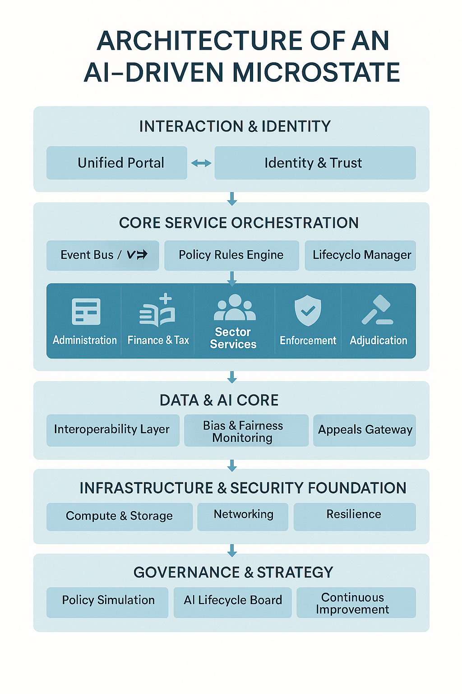

# ÅILAND
A study of how to possibly create the first AI micro state originating from Åland.

## Question
If one were to build a state from the ground up with todays AI support, how would it look like?

## Background Research
https://chatgpt.com/s/dr_68150fe331e88191b3a60213bb110089 
## 🧠 Core Functions for an AI-Driven Microstate

| **Domain**               | **Function Needed**                            | **Automation Potential** | **AI Technologies Needed**                                    |
|--------------------------|------------------------------------------------|---------------------------|----------------------------------------------------------------|
| **Identity & Access**    | Digital ID & Authentication                    | High                      | Identity verification, blockchain/DLT, biometric recognition   |
| **Administration**       | Citizen self-service portal                    | High                      | NLP chatbots, expert systems, RPA                              |
|                          | Records & registry management                  | High                      | RPA, document AI, rule-based automation                        |
|                          | Permit/license processing                      | High                      | Expert systems, OCR/NLP, automated workflows                   |
|                          | Inter-agency data exchange                     | High                      | Secure data interoperability platform (e.g. X-Road)            |
| **Finance & Tax**        | Tax calculation & filing                       | High                      | Rule-based engines, anomaly detection, predictive analytics    |
|                          | Budget forecasting & allocation                | Medium–High               | ML models, economic simulators                                 |
|                          | Expense tracking & procurement                 | Medium–High               | Optimization algorithms, spend analytics                       |
| **Healthcare**           | Appointment scheduling & triage                | High                      | Chatbots, decision trees, speech-to-text                       |
|                          | Diagnostic decision support                    | Medium                    | Medical imaging AI, symptom checker NLP                        |
|                          | Public health monitoring                       | High                      | ML prediction, anomaly detection in health trends              |
| **Education**            | Personalized learning platforms                | Medium                    | AI tutors, recommendation engines                              |
|                          | Student performance tracking                   | High                      | Learning analytics, dashboarding                               |
| **Social Services**      | Benefit eligibility decisions                  | High                      | Expert systems, RPA                                            |
|                          | Risk prediction for at-risk groups             | Medium–High               | Predictive ML, classification models                           |
| **Law Enforcement**      | Predictive policing (patrol optimization)      | Medium                    | Pattern recognition, geographic heat mapping                   |
|                          | Surveillance & anomaly detection               | Medium–High               | Computer vision, facial recognition                            |
|                          | Environmental & zoning compliance              | High                      | Satellite imagery analysis, drone vision, geospatial AI        |
| **Judicial**             | Small claims resolution                        | Medium                    | Rule-based AI judges, NLP, case triage                         |
|                          | Dispute mediation support                      | Medium                    | NLP dialogue systems, sentiment analysis                       |
|                          | Legal research & decision drafting             | High                      | NLP, semantic search, summarization                           |
| **Legislation**          | Policy impact simulation                       | Low–Medium                | Multi-variable modeling, agent-based simulations               |
|                          | Public sentiment analysis                      | Medium                    | NLP, social listening tools                                    |
| **Diplomacy/External**   | Data-driven negotiation prep                   | Low                       | Translation AI, economic modeling                              |
|                          | AI-supported treaty analysis                   | Low                       | NLP legal summarization                                        |
| **Governance Oversight**| Audit trail generation & transparency tools    | High                      | Explainable AI (XAI), blockchain logs                          |
|                          | Ethical compliance monitoring                  | Medium                    | AI bias detection, fairness analysis                           |
|                          | Human-in-the-loop escalation systems           | Required                  | Workflow routing, override mechanisms                          |

<audio controls>
  <source src="AI i Åländsk Förvaltning.wav" type="audio/wav">
  Your browser does not support the audio element.
</audio>

## 
